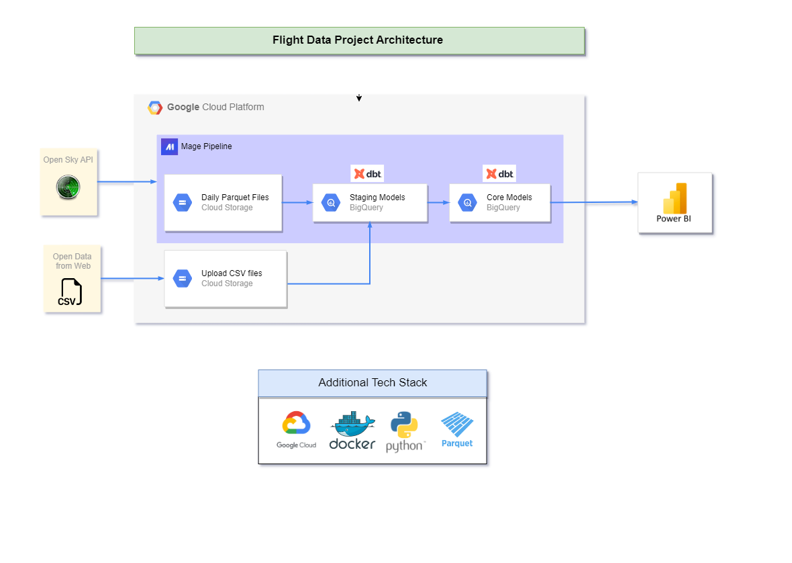
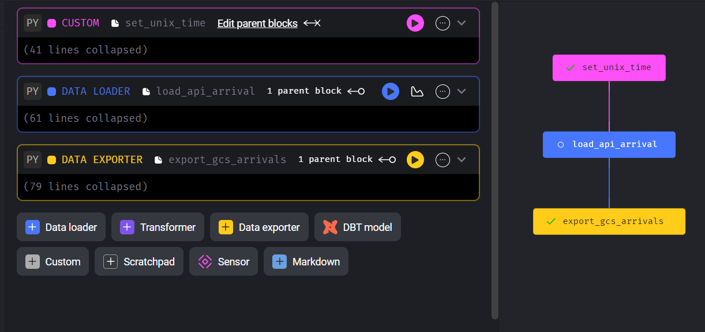
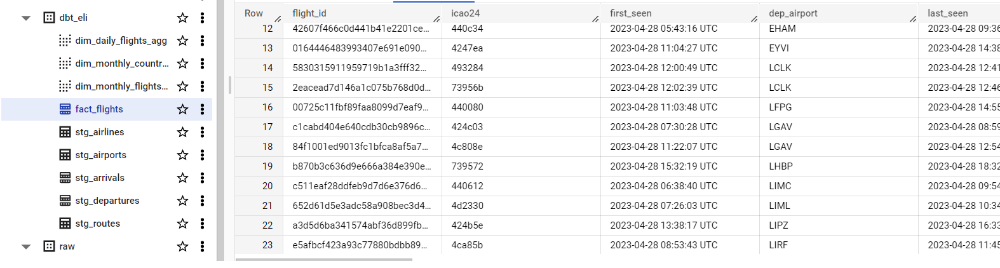
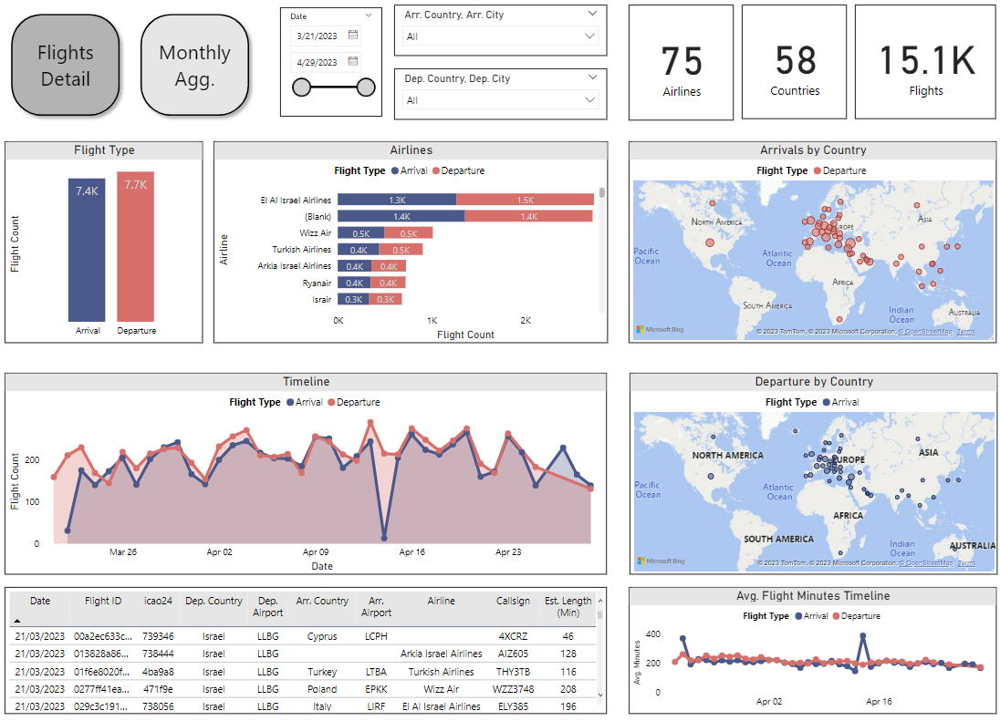
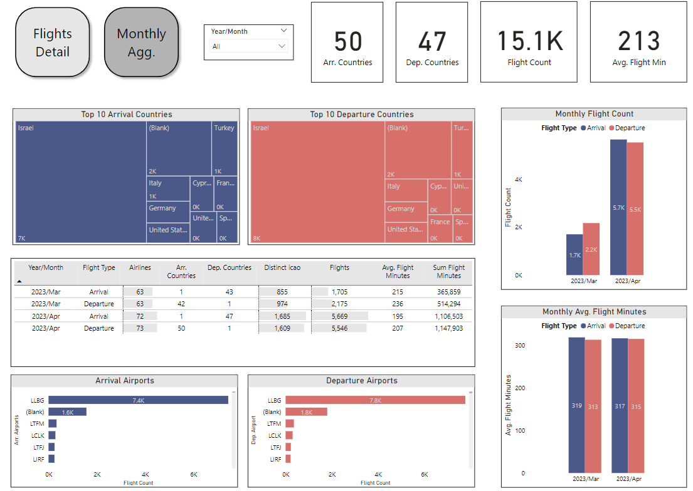

## Overview

This is my final project submission for the Data Engineer Zoomcamp Course. It aims to build an end-to-end orchestrated data pipeline, using technologies such as Google Cloud Platform (GCP), Docker, Python programming, DBT, and more.

For my project, I decided to explore arrival & departure flight patterns, specifically from Israel's Ben Gurion Airport (airport code LLBG). I've used a free API by OpenSky Network that has the ability to query by the airport and a given timeframe. Another data source I've used is airport & airline info from OpenFlights, to cross-reference the data and get more info such as origin country, airline name, etc.

The Flight data is queried daily, saved the result in a Parquet file on Google Cloud Storage (GCS), and pulled to BigQuery Data-Warehouse. Then, with the help of DBT, models (SQL tables) are built on top of these files - first staging models, and then core models ready for consumption. Finally, I've created a dashboard in Power BI with two tiles in order to investigate the patterns in a graphical manner - with bar charts, maps, and timelines.

## Business Questions

1. How many flights are arriving/departing from LLBG?
2. What are the top airlines that fly into/out of LLBG?
3. From which countries are the arrivals/departures coming?
4. How long, on average, are these flights?
5. What is the difference on a monthly level of all these questions above?

## Technologies

* Container Development: `Docker`
* Cloud: `Google Cloud Platform (GCP)`
* Data Lake: `Google Cloud Storage (GCS)`
* Data Transformation: `DBT`
* Data Warehouse: `BigQuery`
* Orchestration Tool: `Mage AI`
* Data Visualization: `Power BI`
* Programing Langues: `SQL & Python`

## Architecture

## Steps

This project is meant to demonstrate the end-to-end flow of data from raw files & api calls to a dashboard:

* Extract the data from the API on a daily basis and the raw files as well, in an orchestration tool (Mage AI) in an automated manner.
* Ingest the API data by loading transformed parquet files into a GCS bucket.
* Load external files into a BigQuery Data Warehouse, and transform the data using DBT - creating staging & core models.
* Connect the final models (SQL tables) into a Power BI Dashboard, and investigate the data to extract insights.

## Screen Shots

## Dataset

Here is the final fact_flights information table, one of the final core models:

| Column                     | Description                                                                                             |
| :------------------------- | :------------------------------------------------------------------------------------------------------ |
| flight_id                  | Primary key, generated in DBT                                                                           |
| icao24                     | Unique ICAO 24-bit address of the transponder in hex string representation. All letters are lower case. |
| first_seen                 | Estimated time of departure for the flight as Unix time (seconds since epoch).                          |
| dep_airport                | ICAO code of the estimated departure airport. Can be null if the airport could not be identified.       |
| last_seen                  | Estimated time of arrival for the flight as Unix time (seconds since epoch)                             |
| arr_airport                | ICAO code of the estimated arrival airport. Can be null if the airport could not be identified.         |
| callsign                   | Callsign of the vehicle (8 chars). Can be null if no callsign has been received.                        |
| dep_airport_horiz_distance | Horizontal distance of the last received airborne position to the estimated departure airport in meters |
| dep_airport_vert_distance  | Vertical distance of the last received airborne position to the estimated departure airport in meters   |
| arr_airport_horiz_distance | Horizontal distance of the last received airborne position to the estimated arrival airport in meters   |
| arr_airport_vert_distance  | Vertical distance of the last received airborne position to the estimated arrival airport in meters     |
| flight_type                | Is it an Arrival or Departure flight                                                                   |
| airline_name               | Airline associated to the flight, may be Null                                                           |
| airline_aita               | AITA code of airline                                                                                    |
| airline_icao               | ICAO code of airline                                                                                    |
| airline_country            | Country of airline                                                                                      |
| dep_airport_name           | Name of the Departure Airport                                                                           |
| dep_airport_city           | City of the Departure Airport                                                                           |
| dep_airport_country        | Country of the Departure Airport                                                                        |
| arr_airport_name           | Name of the Arrival Airport                                                                             |
| arr_airport_city           | City of the Arrival Airport                                                                             |
| arr_airport_country        | Country of the Arrival Airport                                                                          |

Table is optimized by:

* Partitioned on the `first_seen` column (on a daily level) to allow for efficient data filtering based on specific date ranges.
* Clustered on the `flight_type`, `dep_airport_country`, `arr_airport_country` columns to improve query performance and data locality.

## How to Reproduce ?

Please check the [tutotial](https://github.com/elijellyeli/flight-project/blob/main/recreate_project/how_to.md "Recreate Project") to recreate the project

## Dashboard

[Click here](https://app.powerbi.com/view?r=eyJrIjoiMTExYzNhM2EtZjExOS00NTZkLTllOGEtODNiZjE1M2QzYTE0IiwidCI6ImE3YzJiM2ZlLWE2ZjQtNDk0Ni04YjI0LTc4OTM0NmYzMjcyZCIsImMiOjl9&pageName=ReportSectionfb7b74e107e6c96c0524 "PowerBI Dashboard") to access my dashboard on Power BI Service

## What's Next?

Next steps can be:

1. Adding more cross reference data such as data on countries or other sources
2. Implementing IaC logic such as Terraform - to create a Project, buckets and other resources easily with a command
3. Creating a Compute Instance on google and pushing the Docker Image to run in the cloud, instead of locally.
4. Move the creation of the static Airport/Airline CSV to a Mage Pipeline for easier running.

## Reference

[Data Engineering Zoomcamp GitHub](https://github.com/DataTalksClub/data-engineering-zoomcamp) 

[cycling DE project readme](https://github.com/zabull1/cycling_DE_project/tree/main)
